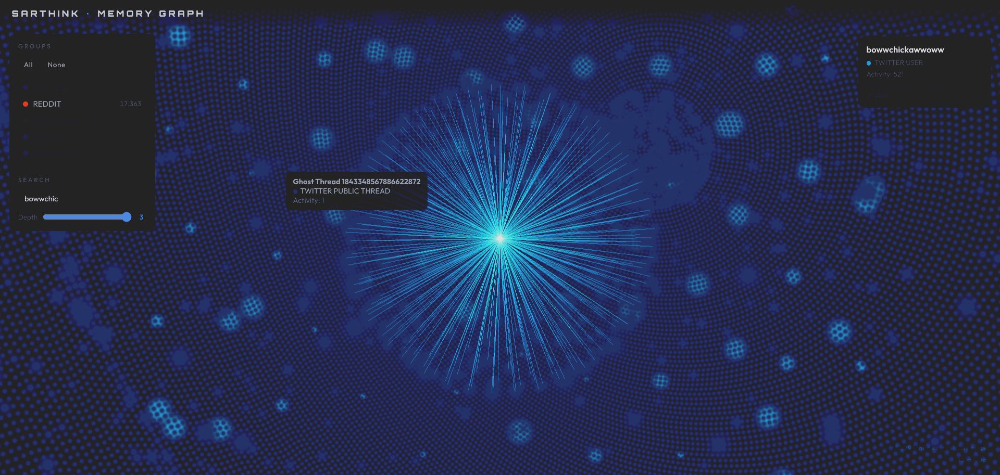

# Sarthink

**Sarthink** is an experimental system for visualizing and exploring your personal digital history as a unified social graph. It bridges the gap between fragmented social media archives (Twitter, Reddit, Discord, etc.) by reconstructing conversation threads and mapping your identity across platforms.

<video controls src="graph-thing.mp4" title="Title"></video>



## Currently at Stage 2 (Memory Graph)

> [!WARNING]
> **EXPERIMENTAL** This is an experimental project and may not be suitable for production use. I do not guarantee if it will work for you. There can be a lot of difference between our data exports and the way they are processed.

## Project Architecture

The project is structured into three main layers, with all logic centralized in the `scripts/` directory:

1.  **Ingestion & Context** (`scripts/context/`): Tools to bridge the "missing link" in data exports. While social media archives often only include your own messages, these scripts fetch the surrounding conversation context (replies, parent posts) to reconstruct meaningful threads.
2.  **Parsing & ETL** (`scripts/parsers/`): A suite of Python scripts that normalize raw exports and fetched context into a structured SQLite database and JSONL logs.
3.  **Semantic Intelligence** (`scripts/semantic/`): Advanced processing to chunk, summarize (via LLMs), and embed conversational data for semantic search and cognitive memory.
4.  **Utilities & Analysis** (`scripts/utils/`, `scripts/analysis/`): Shared helper scripts for database management, layout computation, and specific data extraction tasks.
5.  **Data Storage** (`processed_data/`): Structured into `db/` (SQLite), `logs/` (JSONL), `context/` (Fetched conversation context), `graph/` (CSV/LanceDB), `semantic/` (Processing outputs), and `metadata/` (Identity maps).
6.  **Visualization** (`sarthink_graph.html`): A high-performance 3D memory graph rendered via Three.js.

## Getting Started

### 1. Prerequisites
- Python 3.8+
- Social media data exports (Twitter Takeout, Reddit Export, etc.)

### 2. Environment Setup
Clone the repository and install dependencies:
```bash
pip install requests asyncpraw ijson pandas openai tiktoken lancedb sentence-transformers
```

Configure your credentials by copying the example environment file:
```bash
cp .env.example .env
```
Fill in your API keys for Twitter (SocialData), Reddit (OAuth), and Cerebras (for summarization) in the `.env` file.

### 3. Identity Mapping
To group your nodes correctly across platforms, define your handles in `config/identity_map.json`. You can use the provided example as a template:
```bash
cp config/identity_map.json.example config/identity_map.json
```

### 4. Data Archive Placement
Sarthink dynamically searches your repository for data, but relies on a standard `archive/` folder at the root of the project to locate your raw data exports safely:
```text
sarthink/
├── archive/
│   ├── reddit-export/          # Folder containing your Reddit posts.csv, comments.csv, etc.
│   ├── discord-export/         # Folder containing your Discord JSON exports
│   ├── any_meta_export.zip     # Raw Meta GDPR zips (Facebook/Instagram)
│   └── tweets.js               # Twitter JS files (found recursively)
```

## Workflow

### A. Context Fetching
Fetch the conversation context that isn't included in your raw exports:
- **Twitter**: Run `python3 scripts/context/twitter_fetch_context.py`
- **Reddit**: Run `python3 scripts/context/reddit_fetch_context.py`

### B. Parsing Data
Run the platform-specific parsers to populate the database:
```bash
python3 scripts/parsers/twitter_parser.py
python3 scripts/parsers/reddit_parser.py
python3 scripts/parsers/discord_parser.py
python3 scripts/parsers/meta_parser.py
```

### C. Semantic Pipeline (Optional)
Chunk and summarize your data for search:
```bash
python3 scripts/semantic/chunk_builder.py
python3 scripts/semantic/summarizer.py
python3 scripts/semantic/embedder.py
```

### D. Graph Generation
Compute the 3D layout and export the data for the web UI:
```bash
python3 scripts/utils/compute_layout.py
python3 scripts/utils/export_cosmograph.py
```

### E. Visualizing
Run a local web server to view the graph:
```bash
python3 -m http.server 8000
```
Then visit `http://localhost:8000/sarthink_graph.html`.
