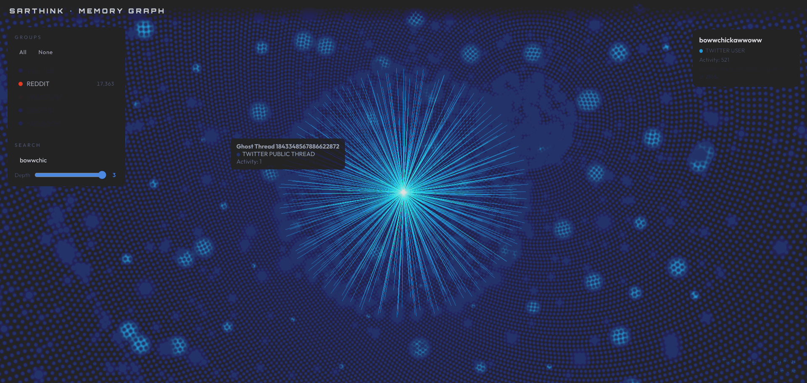
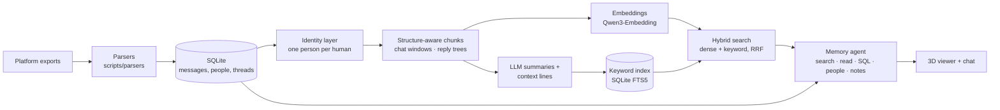

# Sarthink

**A private second brain built from your social-media history.** Sarthink turns years of exported chats
(Twitter/X, Reddit, Discord, Instagram, Facebook) into one memory you can explore and talk to: a 3D graph of
everyone you've talked to, and an assistant that answers questions about your own life with citations to the
exact messages — and lights up those people and conversations in the graph.



---

## Try it in 2 minutes (fictional demo data)

The repo ships a **fictional** archive ("Aarav Mehta", ~2,500 messages across 4 platforms, 2024–2025) so you
can run everything without anyone's real data.

```bash
pip install -r requirements.txt
cp .env.example .env          # optional: add DEEPSEEK_API_KEY to enable the assistant
python3 run.py --demo         # then open http://127.0.0.1:8000
```

- Python 3.10+. The first start downloads a small embedding model (~1.2 GB, Qwen3-Embedding-0.6B) and runs it
  on CPU. Plug your laptop in — on battery, CPU search can take several seconds per query.
- **Without** a DeepSeek key you still get the graph, semantic search, person dossiers (stats + themes),
  the commitments inbox and "on this day". The key enables the chat assistant and day reviews (a typical
  answer costs about half a US cent).

### Things to try in the demo
| Do this | What it shows |
|---|---|
| Ask *"Why did we miss the train to Goa?"* | cited answer from a group chat; the graph lights up the friends involved |
| Ask *"What stipend did Nimbus Labs offer, and what did Dev think?"* | facts combined across Instagram and Discord |
| Ask *"Who do I talk to the most?"* and open **📊 How these numbers were computed** | exact counts from SQL, with the query and a chart |
| Click **Meera** in the graph | dossier: activity over time (watch the 2025 gap), themes, where you talk |
| Click **📥 Inbox** | promises found in chats (e.g. "Scan and send offer letter to Ananya") → done / calendar (.ics) |
| Click **📅 On this day**, pick 21 Dec, *Review this day* | journal-style recap of that day, cited |
| Say *"please remember that Kabir is my school friend from Patna"*, then ask about Kabir | plain-language notes that come back only when relevant |
| Ask *"When did I go skydiving?"* | it says it can't find it instead of inventing a memory |

---

## What it does

- **Ask your memory** — an agent searches, reads whole conversations, runs read-only SQL for numbers, and
  answers with numbered citations `[n]` that open the exact messages. A fact-check pass removes claims the
  sources don't support. Live progress ("🔎 searching…", "📖 reading…") streams while it works.
- **3D memory graph** — you at the centre, people placed by how much you talk, conversations between the
  people in them, one region per platform. Answers fly the camera to what they cite.
- **Person dossiers** — click anyone: message totals, who writes more, monthly activity, recurring themes
  (with example conversations), and where you talk.
- **Commitments inbox** — promises and plans found in your chats, both yours and others', with due dates
  resolved from the conversation date; mark done or add to your calendar.
- **On this day + day review** — your conversations on this date in earlier years, and a cited recap of any day.
- **Notes** — tell it things in plain language ("remember that FireRoz uses she/her"); notes attach only when
  that person or topic comes up, and are cited as `[note]`.
- **Identity resolution** — your accounts across platforms are one "me"; other people can be merged with
  `person_merges.json`; deleted/deactivated accounts become one person per chat with honest names.
- **Privacy guards** — phone numbers, emails, addresses and order numbers are masked in answers; data and
  notes stay in local files.

## How it works


```mermaid
flowchart LR
  A[Platform exports] --> B[Parsers<br/>scripts/parsers]
  B --> C[(SQLite<br/>messages, people, threads)]
  C --> D[Identity layer<br/>one person per human]
  D --> E[Structure-aware chunks<br/>chat windows · reply trees]
  E --> F[LLM summaries +<br/>context lines]
  E --> G[Embeddings<br/>Qwen3-Embedding]
  F --> H[(Keyword index<br/>SQLite FTS5)]
  G --> I[Hybrid search<br/>dense + keyword, RRF]
  H --> I
  I --> J[Memory agent<br/>search · read · SQL · people · notes]
  C --> J
  J --> K[3D viewer + chat]
```

- **Deterministic core, LLM on top.** SQLite is the source of truth; counts and dates come from SQL, never
  from a model. LLM output (summaries, themes, commitments, notes) is a separate, labelled layer.
- **Chunking** is structure-aware: chats split into sessions on inactivity gaps and ~300-token windows; reply
  trees keep their ancestor context; every chunk links to its exact message ids (for citations and graph
  highlighting).
- **Search** fuses Qwen3-Embedding vectors with keyword search (reciprocal-rank fusion). With your own data we
  use the 8B model on a rented GPU via a stateless embedding service; the demo uses 0.6B on CPU.
- **Agent**: DeepSeek (reasoning mode) with tools; answers are post-processed (citation mapping, redaction)
  and optionally fact-checked against every source it read.

## How well it works

Measured on the author's real archive (302,794 messages, 2011–2026):

| Eval | Result |
|---|---|
| Retrieval: 325 recall questions, right conversation in top 1 / top 10 | **88% / 98%** |
| Agent: 92 questions (lookups, stats, timelines, Hinglish, multi-hop) — expected facts found | **90%** |
| Questions about things that never happened — correctly says it can't find them | **10 / 10** |
| Agent cited the exact conversation holding the answer (30 generated lookups) | **30 / 30** |
| Claims not supported by their cited source (with fact-check pass) | **3%** |
| Notes: saved, recalled when relevant, not leaked into unrelated answers | **10 / 10** |
| Median answer time / typical cost per answer | ~25–30 s / ~$0.005 |

Eval code: `scripts/index/needle_eval.py`, `scripts/api/agent_eval.py`, `scripts/api/notes_eval.py`.

## Using your own data

The full pipeline (each step is rerunnable; IDs are deterministic so rebuilds only redo what changed):

```bash
# 1. parse exports into processed_data/db/sarthink_memory.db
python3 scripts/parsers/{twitter,reddit,discord,meta}_parser.py      # see scripts/parsers for expected inputs
python3 scripts/context/{twitter,reddit}_fetch_context.py            # optional: fetch missing parent posts
# 2. build the memory index (processed_data/db/sarthink_index.db)
python3 scripts/index/build_identity.py          # people; your handles come from config/identity_map.json
python3 scripts/index/build_chunks.py && python3 scripts/index/check_chunks.py
python3 scripts/index/summarize_sessions.py      # DeepSeek; ~$14 for 300k messages
python3 scripts/index/build_fts.py
python3 scripts/index/build_embeddings.py --model Qwen/Qwen3-Embedding-0.6B   # or 8B on a GPU (remote_embed.sh)
python3 scripts/index/build_commitments.py
python3 scripts/utils/export_cosmograph.py && python3 scripts/utils/compute_layout.py
# 3. run
python3 run.py --model 0.6b                      # or: python3 run.py --gpu <ssh_host> <ssh_port>  (8B encoder)
```

### Adding a newer export

Put the new export next to the old one in `archive/` (keep the old one) and rerun the same steps. Parsers only
add: messages already stored are skipped (Instagram/Facebook ones are matched by chat, time and text, since
their ids change between exports), and messages that only the old export still has are kept. People keep
their `person_id` across rebuilds (recorded in `user_notes.db`, table `PersonIds`), so notes, merges and
the graph stay attached to the right person. Unchanged conversations keep their session and chunk ids, so
`summarize_sessions.py` only pays for new ones, and until the new chunks are embedded search finds them by
keyword. Don't delete `sarthink_index.db` to update: it holds the paid-for summaries.
`--fresh` on the Twitter/Meta parsers wipes that platform and reparses it; it is not needed for updates.

`scripts/demo/generate_demo.py` shows how the demo archive was generated and is a template for testing.

## Project layout

```
run.py                     one-command launcher
sarthink_graph.html        3D viewer + chat, dossier, inbox (single file, Three.js)
scripts/parsers/           platform export parsers -> SQLite
scripts/context/           fetch missing reply context (Twitter, Reddit)
scripts/index/             identity, chunking, summaries, keyword index, embeddings, commitments, evals
scripts/api/               search API + memory agent (server.py, agent.py), evals, SSH tunnel
scripts/utils/             graph export + 3D layout
demo/                      fictional demo archive with its index, vectors and graph
docs/ROADMAP.md            design decisions and progress
```

## Limitations

- Answers can still be wrong; every claim is cited so it can be checked.
- Commitments and themes are extracted by an LLM and can be noisy.
- Deleted accounts lose their names; a few real names are recovered only when a chat explicitly shows them.
- With your own data, the LLM steps send message text to the model provider (DeepSeek); the graph, search,
  stats and notes stay local.
